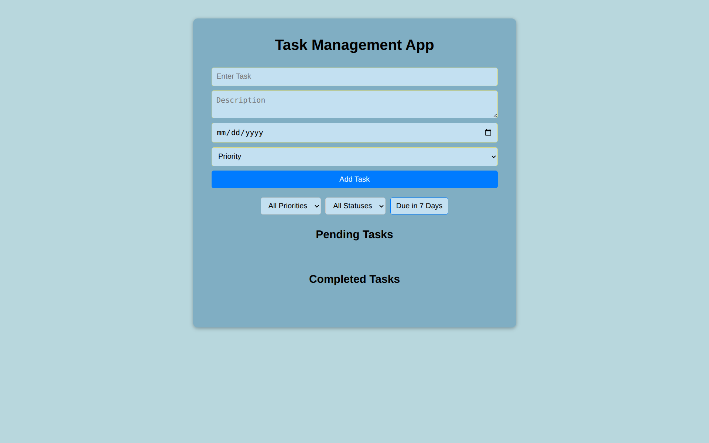
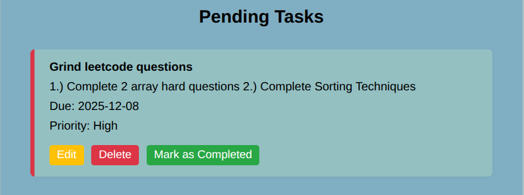
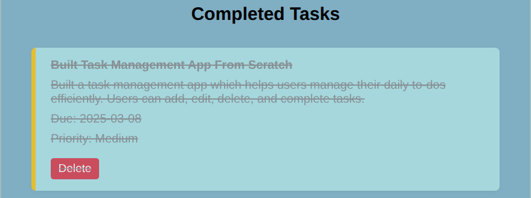

# 📋 Task Management App

A simple and interactive Task Management Web App that helps users manage their daily to-dos efficiently. Users can add, edit, delete, and complete tasks — all while enjoying real-time updates and persistent data storage.

---

## 🚀 Features

- ✅ **Add New Tasks** with:
  - Title
  - Description
  - Due Date
  - Priority (Low, Medium, High)
- 📝 **Edit** existing tasks
- ❌ **Delete** tasks you no longer need
- ✔️ **Mark Tasks as Completed** — moves to a separate section
- 🎯 **Filter Tasks** by:
  - Priority
  - Due Date (e.g., tasks due in the next 7 days)
  - Completion Status (Pending / Completed)
- 💾 **Task Persistence** using LocalStorage — your tasks stay even after reloading!

---

## 🛠️ Tech Stack

- **HTML5**
- **CSS3**
- **Vanilla JavaScript (ES6+)**
- *(No frameworks used — built from scratch)*

---


## 📸 Screenshots

### 🆕 Task Form


### 📋 Pending Tasks


### ✅ Completed Tasks



---

## 📂 Project Structure

```
📁 task-manager-app/
├── index.html                  ← Main HTML file (entry point)
├── style.css                   ← Styling for your app
├── script.js                   ← All JavaScript logic
├── README.md                   ← This documentation file
├── 📁 screenshots/             ← Folder containing images used in README
│   ├── task-form.png
│   ├── pending-tasks.png
│   └── completed-tasks.png
```


